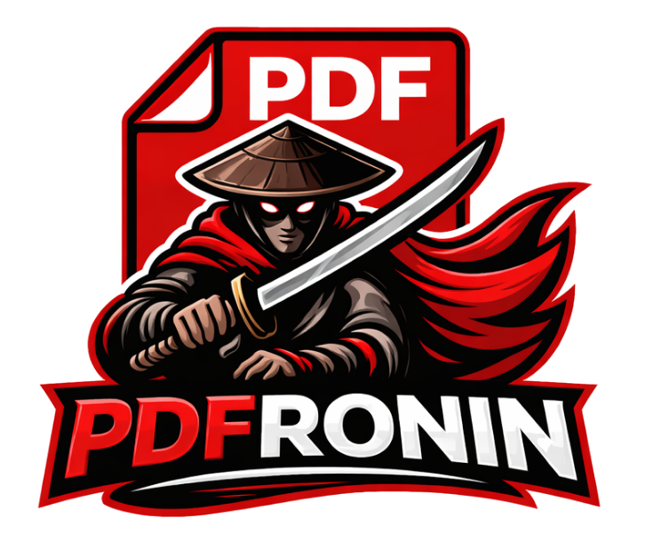

  

# PDFronin

PDFronin is a fast, lightweight PDF reader and light-touch editor for **Windows**. It opens documents instantly, scrolls and zooms without stutter even on large files, and gives you the everyday tools you actually need without burying them under a paywall or a browser-style UI.

## What it can do
- view PDfs
- highlight, underline, strike-through
- sticky notes
- free text, drawing with presets
- images, stamps
- page deletion
- merge documents
- search
- OCR
- printing

## Why I built it

Most PDF programs on Windows fall into two camps: heavy commercial suites that are slow, spammy, and push cloud sign-ins, or minimalist viewers that can't really edit. 
At a university, where you read dozens of lecture scripts, papers, scanned handouts and exam drafts every week, neither is a good fit. You want to pull up a 400-page course reader in a second, highlight a passage while the lecturer is still talking, add a sticky note before your brain forgets the idea, and move on. Later you want to delete the cover pages, merge two handouts, OCR a scanned chapter, and print a clean copy for the exam — all without a subscription, an account, or a round-trip through someone's cloud.

PDFronin is built around that workflow:

- **Fast** — native rendering via PDFium, aggressive tile caching, async I/O; opens and scrolls big documents smoothly on a laptop.
- **Capable enough** — annotations, free text, ink with pen and touch, stamps, images, page reordering and deletion, document merge, full-text search, OCR (German + English shipped), print (native + print-to-PDFronin).
- **Nothing in the way** — no account, no telemetry, no upsell, all settings local. Dark mode, keyboard-first, multi-tab, drag-and-drop, session restore.
- **Honest defaults** — saves annotations into the PDF itself where the format allows, into a small sidecar file where it doesn't; nothing proprietary you'd lose access to later.

It's intentionally not a replacement for professional PDF production tools. It's the reader and everyday annotator I wanted on my own machines for reading, studying, marking up and printing — so I wrote it.

## Download
[Windows Installer 1.1.1](https://github.com/rorugi/pdfroninapp/releases/download/v1.1.1/PDFronin-1.1.1-x64-setup.exe)
